# FOSSEE Workshop Booking Portal — UI Enhancement

This project was completed as part of the FOSSEE UI/UX screening task. The objective was to improve the usability, structure, and responsiveness of the existing Django-based workshop booking system without modifying backend logic.

---

## Objective

The original system was functional but lacked clarity in navigation, layout consistency, and mobile usability.

The goal was to improve:

* Visual hierarchy
* Navigation flow
* Form usability
* Responsiveness
* Overall user experience

while keeping the backend intact.

---

## Initial UI Audit

A UI audit was conducted before making any changes.

### Key Issues Identified

* Minimal and outdated interface
* No clear landing or entry point
* Confusing navigation flow
* Poorly structured forms
* Inconsistent spacing and alignment
* Weak responsiveness on smaller screens
* Low readability due to poor contrast

---

## Improvements Implemented

### Base Layout Redesign

* Introduced consistent spacing and alignment
* Improved typography and readability
* Standardized navbar and footer

### Landing Experience

* Added a hero section on the Workshop Types page
* Established it as the primary entry point
* Added clear call-to-action buttons

### Navigation Improvements

* Removed redundant Home link
* Used logo as navigation anchor
* Fixed inconsistent routing
* Unified navigation across pages

### Form UI Improvements

* Converted raw forms into structured card layouts
* Added labels for clarity
* Improved spacing and alignment

### Table Enhancements

* Improved readability and spacing
* Added hover states
* Improved alignment and structure

### Responsiveness

* Adjusted layouts for mobile screens
* Ensured tables are scrollable instead of breaking
* Optimized spacing and stacking of elements

### React Integration

* Implemented a card view toggle on Workshop Types page
* Used React via CDN without affecting backend
* Maintained table view as fallback

### Stability Fixes

* Fixed root URL dependency on CMS
* Added fallback routing
* Resolved login/profile-related errors

---

## Design Decisions & Reasoning

### What design principles guided your improvements?

The redesign focused on clarity, consistency, and usability.

Visual hierarchy was improved using spacing, typography, and grouping so users can quickly understand each section. Consistency was maintained across all pages by standardizing layout and components. The user flow was simplified by making the Workshop Types page the main entry point.

---

### How did you ensure responsiveness across devices?

Responsiveness was handled using CSS rather than heavy frameworks.

Layouts were made flexible, tables were made scrollable, and buttons/forms were adjusted for smaller screens. Media queries were used to ensure usability across different screen sizes.

---

### What trade-offs did you make between design and performance?

A full React migration was avoided.

Instead of converting the entire frontend, React was used only where necessary (card view toggle). This maintained performance and avoided unnecessary complexity while still satisfying the requirement.

---

### What was the most challenging part of the task and how did you approach it?

The main challenge was improving UI without modifying backend logic.

Issues like routing inconsistencies and missing dependencies had to be handled carefully without breaking functionality. Each change was implemented incrementally and tested to maintain stability.

---

## UI Transformation (Before vs After)

### 1. Admin and Initial State


**Admin Login**
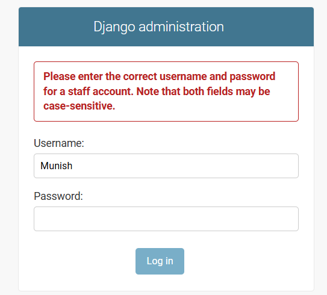

**Admin Panel**
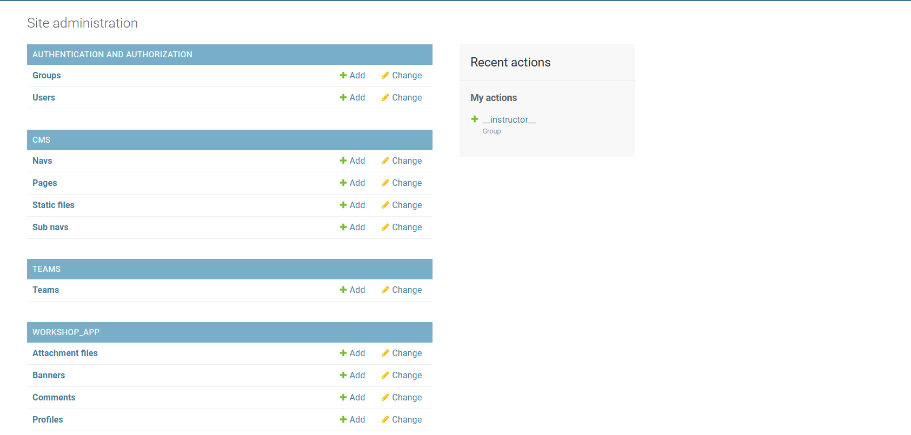

Description:

These show the default Django admin interface and lack of a proper user-facing entry point.

---

### 2. Workshop Types Page

**Before**
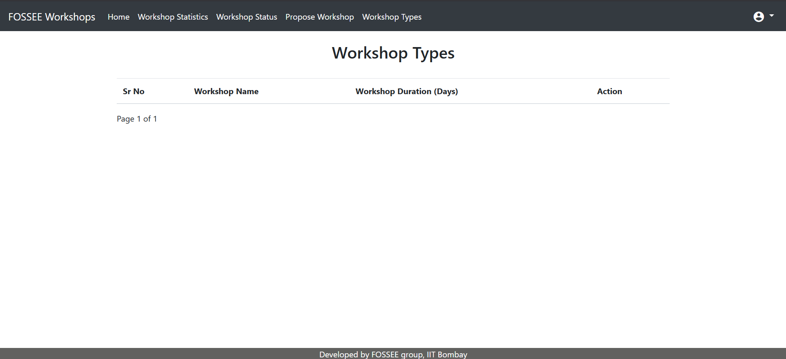

**After**
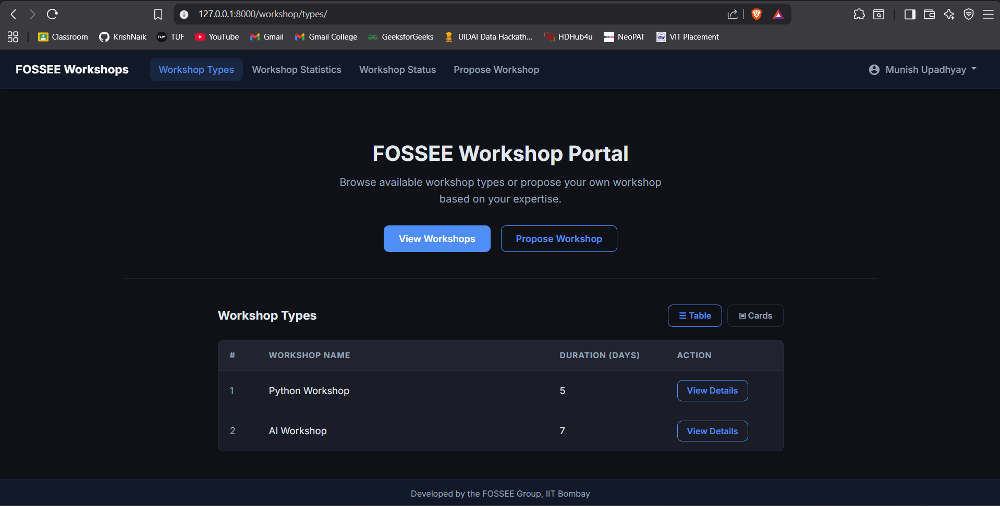

Description:

The page was transformed into a structured landing page with a hero section and improved layout.

---

### 3. Table Improvements


**Workshop Table**

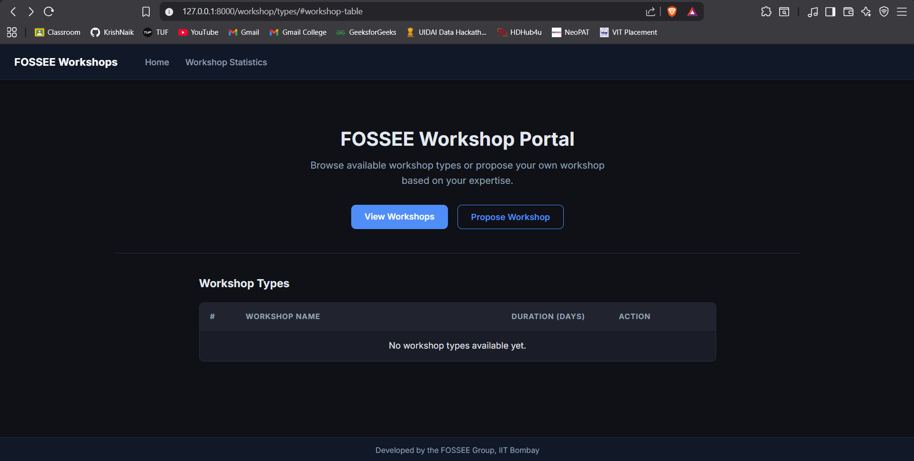
---

### 4. React Card View

**Card View**

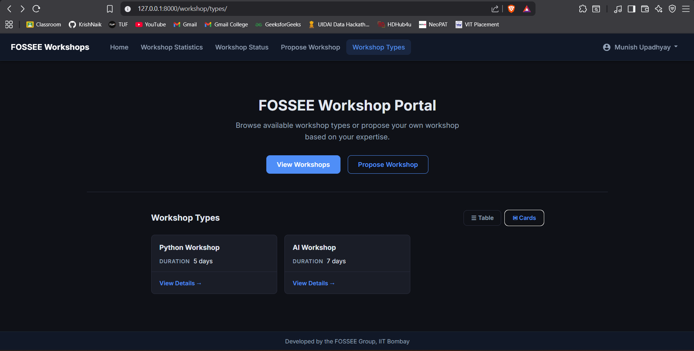

Description:

Introduced an alternative card-based layout for better usability on smaller screens.
This enhancement improves usability on smaller screens where tabular layouts are harder to navigate.

---

### 5. Propose Workshop Form

**Before**
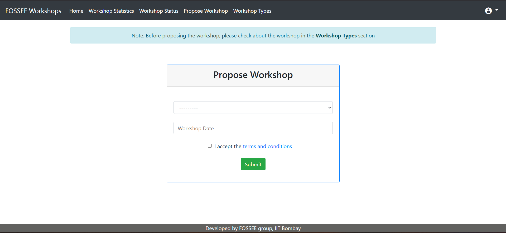

**After**
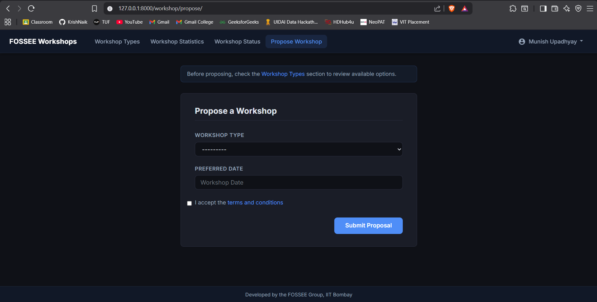

Description:

Converted an unstructured form into a clean, card-based layout with proper labels and spacing.

---

### 6. Workshop Status Page

**Before**
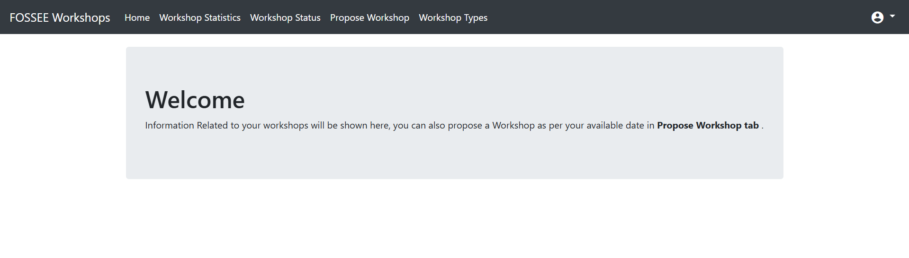

**After**
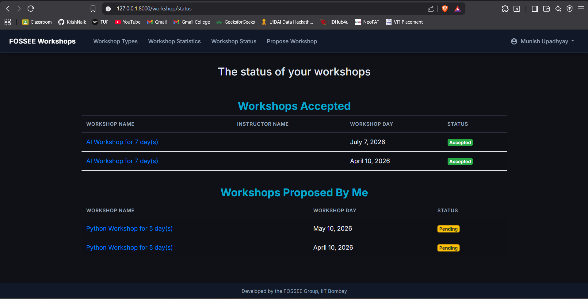

Description:

Improved readability and separation of accepted and proposed workshops.

---

### 7. Workshop Statistics Page

**Before**
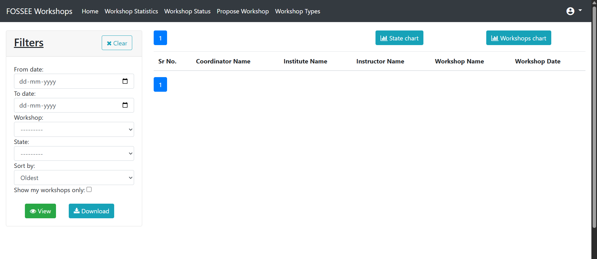

**After**
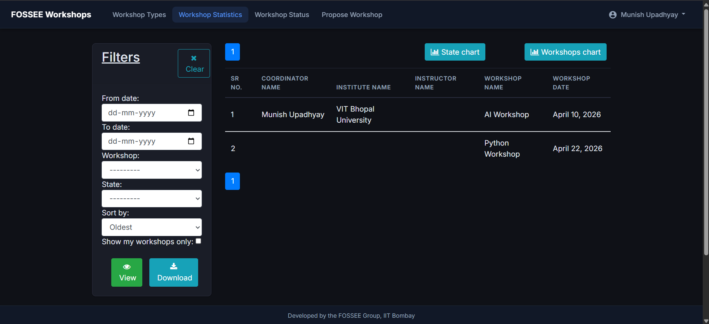

Description:

Enhanced filter layout and overall page structure.

---

### 8. Intermediate Improvements

**Login Page**

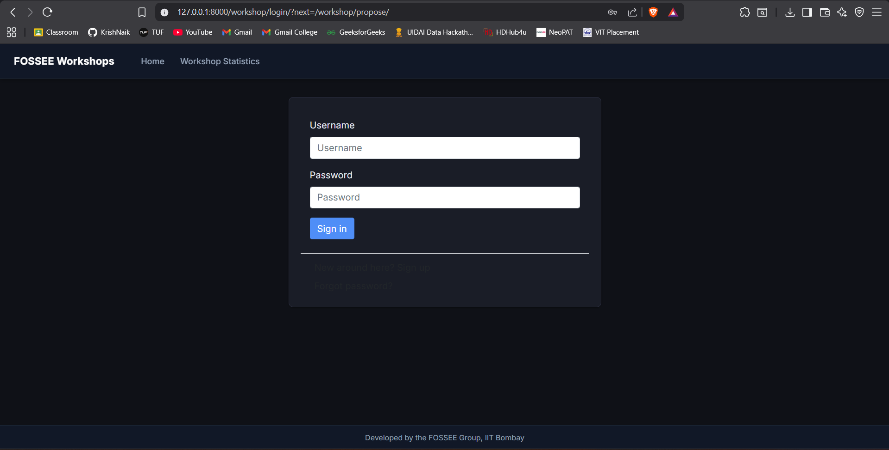

**Workshop Status Page**

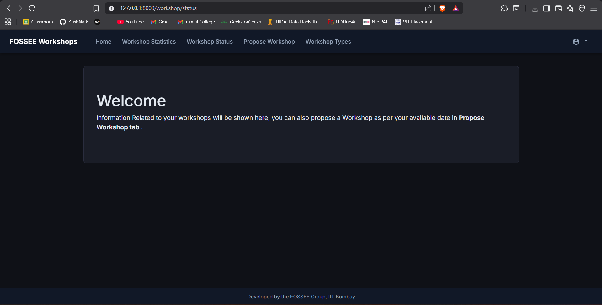

**Workshop Statistics Page**

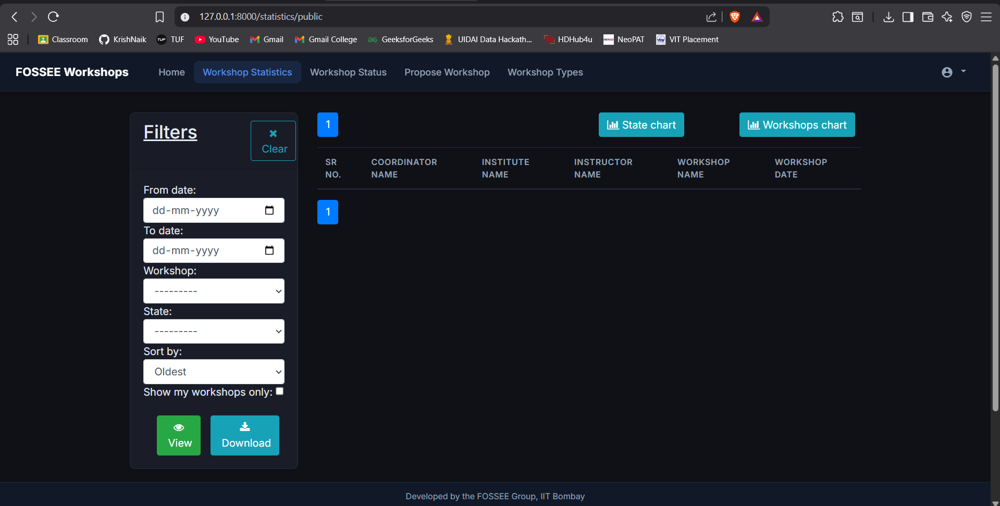

**Workshop Types Page**

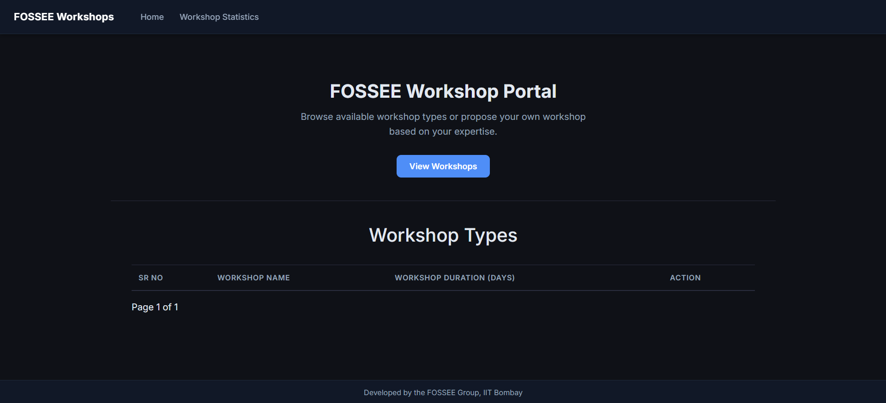

Description:

These show incremental improvements during development before the final UI polish.

---

## Demo Video

[Click here to watch the Demo Video](https://drive.google.com/file/d/1Op206ZBS67ZdTw3-fnKPS3jcSl34Waj9/view?usp=sharing)

The video demonstrates:

* Navigation flow
* Workshop browsing
* Propose workshop flow
* Status tracking
* Statistics filtering
* React card view toggle

---

## How to Run the Project

```bash
git clone https://github.com/FOSSEE/workshop_booking.git
cd workshop_booking

python -m venv venv
venv\Scripts\activate

pip install -r requirements.txt

python manage.py makemigrations
python manage.py migrate

python manage.py createsuperuser

python manage.py runserver
```

Open:
http://127.0.0.1:8000/workshop/types/

---

## Project Documentation

* progress.md — step-by-step development
* ui_audit.md — initial analysis

---

## Final Outcome

The system now provides a cleaner, more structured, and responsive interface while preserving all backend functionality. Improvements were focused on usability and real-world interaction rather than purely visual changes.

## Notes

- Backend logic was intentionally not modified
- Authentication flow (activation, password reset) was left unchanged as it was outside the scope of UI/UX improvements
